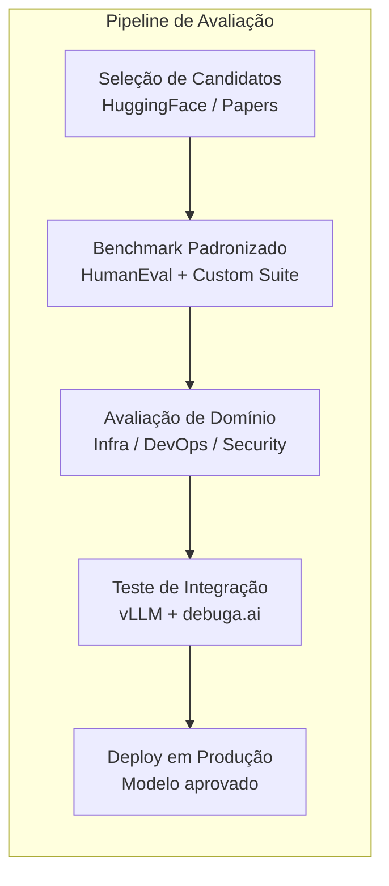
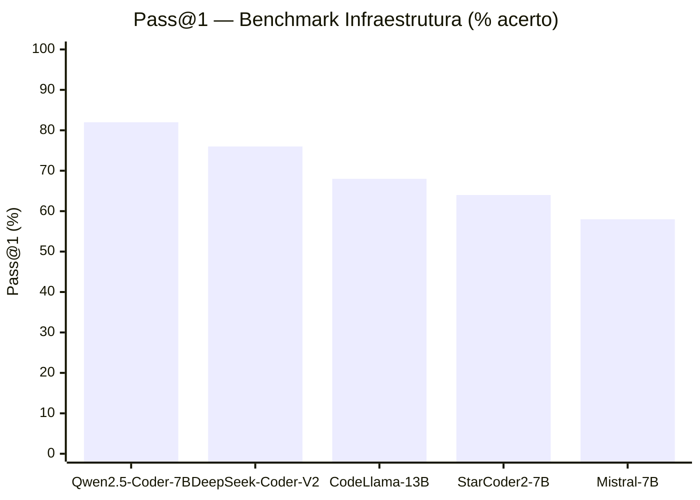
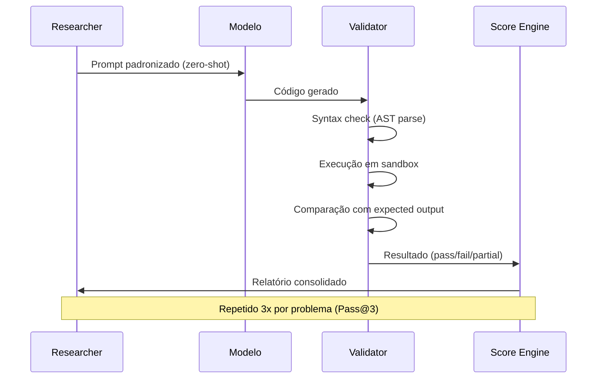
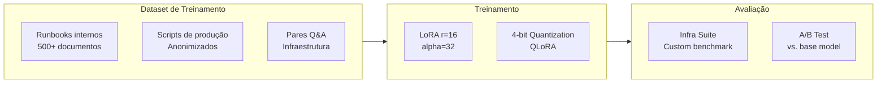
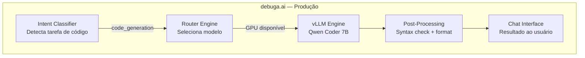

# debuga-qwen-coder-lab

**Laboratório de avaliação, benchmarking e fine-tuning de modelos para geração de código — focado no domínio de infraestrutura, DevOps e automação.**

Desenvolvido por [Sperry Tecnologia](https://www.sperrytecnologia.com.br).

---

## Visão Geral

Este repositório contém os experimentos, benchmarks e metodologias utilizados para selecionar e otimizar os modelos de geração de código da plataforma [debuga.ai](https://debuga.ai). O foco é avaliar modelos open-source para o domínio específico de infraestrutura técnica: scripts de automação, configurações de rede, análise de logs, Dockerfiles, pipelines CI/CD e troubleshooting.



---

## Modelos Avaliados

### Ranking por Performance (Domínio Técnico)



| Modelo | Parâmetros | HumanEval | Infra Suite | VRAM | Latência (P50) |
|--------|-----------|-----------|-------------|------|----------------|
| **Qwen 2.5 Coder 7B** | 7B | 88.4% | 82% | 6 GB | 1.2s |
| DeepSeek Coder V2 Lite | 16B | 86.1% | 76% | 12 GB | 2.1s |
| CodeLlama 13B Instruct | 13B | 74.2% | 68% | 10 GB | 1.8s |
| StarCoder2 7B | 7B | 71.8% | 64% | 6 GB | 1.1s |
| Mistral 7B Instruct | 7B | 67.3% | 58% | 6 GB | 1.0s |

> O **Qwen 2.5 Coder 7B** foi selecionado como modelo primário por oferecer o melhor equilíbrio entre qualidade, VRAM e latência para o domínio de infraestrutura.

---

## Benchmark Suite Customizada

A suite de avaliação foi desenvolvida especificamente para o domínio da debuga.ai:

```mermaid
graph LR
    subgraph Categorias["Categorias de Teste"]
        direction TB
        C1["Bash/Shell Scripts<br/>25 problemas"]
        C2["Docker & Compose<br/>20 problemas"]
        C3["Python Automation<br/>30 problemas"]
        C4["Network Config<br/>15 problemas"]
        C5["CI/CD Pipelines<br/>15 problemas"]
        C6["Log Analysis<br/>20 problemas"]
        C7["Security Hardening<br/>15 problemas"]
    end

    subgraph Métricas["Métricas de Avaliação"]
        direction TB
        M1["Pass@1<br/>Primeira tentativa"]
        M2["Pass@3<br/>Melhor de 3"]
        M3["Syntax Valid<br/>Compilação"]
        M4["Semantic Score<br/>Correção lógica"]
        M5["Security Score<br/>Sem vulnerabilidades"]
    end

    Categorias --> Métricas
```



| Categoria | Problemas | Qwen Coder 7B | DeepSeek V2 | CodeLlama 13B |
|-----------|-----------|---------------|-------------|---------------|
| Bash/Shell Scripts | 25 | **88%** | 80% | 72% |
| Docker & Compose | 20 | **85%** | 75% | 65% |
| Python Automation | 30 | **83%** | 80% | 73% |
| Network Config | 15 | **80%** | 73% | 60% |
| CI/CD Pipelines | 15 | **77%** | 73% | 63% |
| Log Analysis | 20 | **80%** | 76% | 68% |
| Security Hardening | 15 | **78%** | 70% | 62% |

---

## Metodologia de Avaliação



**Critérios de aprovação:**

1. **Syntax Valid** — Código compila/parseia sem erros
2. **Execution Pass** — Executa e produz output esperado
3. **Security Check** — Sem hardcoded secrets, injection vectors ou permissões excessivas
4. **Style Score** — Segue convenções do domínio (shellcheck, pylint, hadolint)

---

## Fine-Tuning (Pesquisa)

Experimentos de fine-tuning com LoRA para especialização no domínio:



| Experimento | Base Model | Método | Melhoria Pass@1 | Status |
|-------------|-----------|--------|-----------------|--------|
| infra-lora-v1 | Qwen Coder 7B | LoRA r=16 | +4.2% | Concluído |
| infra-qlora-v1 | Qwen Coder 7B | QLoRA 4-bit | +3.1% | Concluído |
| devops-lora-v1 | Qwen Coder 7B | LoRA r=32 | +5.8% | Em avaliação |

---

## Prompts Otimizados

Prompts testados e otimizados para cada categoria de tarefa:

| Categoria | Estratégia | Melhoria vs. naive |
|-----------|-----------|-------------------|
| Bash scripts | System prompt com shellcheck rules | +12% |
| Docker | Few-shot com best practices | +15% |
| Python automation | Chain-of-thought + type hints | +8% |
| Network config | Structured output (YAML) | +18% |
| Security | Adversarial examples no prompt | +10% |

---

## Integração com debuga.ai



O modelo selecionado neste laboratório é deployado via vLLM na infraestrutura da debuga.ai, servindo requisições de geração de código com latência < 2s.

---

## Estrutura do Repositório

```
debuga-qwen-coder-lab/
├── benchmarks/           # Resultados de benchmark
├── notebooks/            # Jupyter notebooks de avaliação
├── prompts/              # Prompts otimizados por categoria
├── fine-tuning/          # Scripts e configs de fine-tuning
├── scripts/              # Automação de avaliação
├── docs/                 # Documentação detalhada
├── requirements.txt      # Dependências Python
└── README.md
```

---

## Quick Start

```bash
# 1. Clone
git clone https://github.com/SperryTecnologia/debuga-qwen-coder-lab.git
cd debuga-qwen-coder-lab

# 2. Instale dependências
pip install -r requirements.txt

# 3. Execute benchmark
python scripts/run_benchmark.py --model qwen2.5-coder-7b --suite infra

# 4. Visualize resultados
python scripts/generate_report.py --output results/
```

---

## Repositórios Relacionados

| Repositório | Descrição |
|-------------|-----------|
| [debuga-ai](https://github.com/SperryTecnologia/debuga-ai) | Plataforma principal |
| [debuga-llm-stack](https://github.com/SperryTecnologia/debuga-llm-stack) | Estratégia LLM híbrida (GPU + cloud) |
| [debuga-vllm-engine](https://github.com/SperryTecnologia/debuga-vllm-engine) | Serving local com vLLM |
| [debuga-llm-gateway](https://github.com/SperryTecnologia/debuga-llm-gateway) | Gateway OpenAI-compatible |

---

## Licença

Benchmarks, prompts e documentação sob licença MIT. Datasets de treinamento proprietários não estão inclusos.

---

*Sperry Tecnologia — Infraestrutura, segurança, DevOps e automação com IA.*
