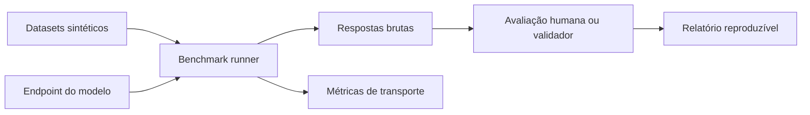

<p align="center">
  
</p>

<h1 align="center">debuga.ai Qwen Coder Lab</h1>

<p align="center">
  <strong>Laboratório experimental para avaliação de modelos em tarefas de Infraestrutura e DevOps</strong>
</p>

<p align="center">
  <a href="#quick-start">Quick Start</a> ·
  <a href="benchmarks/METHODOLOGY.md">Metodologia</a> ·
  <a href="docs/08-BENCHMARKS-E-TESTES.md">Testes</a> ·
  <a href="docs/README.md">Documentação</a> ·
  <a href="SECURITY.md">Segurança</a>
</p>

<p align="center">
  
  
  
  
</p>

---

> [!WARNING]
> Os resultados históricos incluídos em `benchmarks/results/` não possuem, neste snapshot,
> respostas brutas e manifesto completo suficientes para reprodução independente. Eles são
> mantidos como **material ilustrativo**, não como ranking homologado ou evidência de produção.

## Visão geral

O laboratório reúne datasets sintéticos, prompts públicos, notas técnicas e um runner para
consultar endpoints OpenAI-compatible. O foco é organizar experimentos de modelos de código
aplicados a Linux, redes, containers, automação e segurança defensiva.



## Conteúdo atual

| Área | Conteúdo | Estado |
|---|---|---|
| Dataset DevOps | 10 tarefas | Sintético |
| Dataset de rede | 7 tarefas | Sintético |
| Dataset de segurança | 8 tarefas | Sintético |
| Runner HTTP | OpenAI-compatible | Implementado |
| Latência e tokens | Coleta do endpoint | Implementado |
| Avaliação semântica | Não automatizada | Pendente |
| Sandbox de execução | Documentado conceitualmente | Não integrado ao runner |
| Fine-tuning LoRA | Notas e configs | Pesquisa |
| Resultados 7B/14B | Relatórios históricos | Não homologados |

## O que o runner realmente mede

O script `benchmarks/run-benchmark.py` mede:

- sucesso ou falha da requisição HTTP;
- latência total;
- tokens reportados pelo provider;
- tamanho da resposta;
- saída bruta e manifesto da execução.

Ele **não prova** que a resposta está tecnicamente correta. Correção, segurança, estilo e
aderência ao resultado esperado exigem revisão humana ou um validador separado.

## Quick Start

```bash
git clone https://github.com/SperryTecnologia/debuga-qwen-coder-lab.git
cd debuga-qwen-coder-lab
python3 -m venv .venv
source .venv/bin/activate
pip install -r requirements.txt
```

Execute contra um endpoint OpenAI-compatible:

```bash
python benchmarks/run-benchmark.py \
  --model Qwen/Qwen2.5-Coder-7B-Instruct \
  --dataset benchmarks/devops-tasks.jsonl \
  --api-url http://localhost:8000/v1 \
  --output benchmarks/results/runs
```

Quando necessário:

```bash
export LLM_API_KEY='chave-do-endpoint-de-teste'
```

A execução cria:

```text
manifest.json
responses.jsonl
metrics.csv
```

## Metodologia mínima

Um benchmark publicável deve registrar:

1. data, commit e comando;
2. modelo e revisão exata;
3. engine, imagem e versão;
4. GPU, driver e quantização;
5. temperatura, seed quando suportada e limites;
6. dataset e hash;
7. respostas brutas;
8. método de avaliação;
9. limitações e falhas.

Consulte [benchmarks/METHODOLOGY.md](benchmarks/METHODOLOGY.md).

## Resultados históricos

Os arquivos existentes em `benchmarks/results/` são preservados para comparação documental,
mas não devem ser utilizados como prova de superioridade, decisão de compra ou capacidade de
produção. Novos resultados devem ser publicados em pastas de execução com manifesto e dados brutos.

## Estrutura

```text
debuga-qwen-coder-lab/
├── benchmarks/
│   ├── METHODOLOGY.md
│   ├── *.jsonl
│   ├── run-benchmark.py
│   └── results/
├── docs/
├── fine-tuning/
├── notebooks/
├── prompts/
├── scripts/
└── requirements.txt
```

## Documentação

| Documento | Conteúdo |
|---|---|
| [Índice](docs/README.md) | Trilha de leitura |
| [Ollama](docs/01-OLLAMA-O-QUE-E.md) | Conceitos e limitações |
| [GPU e virtualização](docs/02-GPU-HYPERV-DDA-RTX3090.md) | Laboratório de passthrough |
| [NVIDIA Toolkit](docs/03-DOCKER-NVIDIA-TOOLKIT.md) | Runtime de containers |
| [Modelos](docs/04-MODELOS-QWEN-COMPARATIVO.md) | Critérios de comparação |
| [API](docs/05-OLLAMA-API.md) | Exemplos de uso |
| [Sandbox](docs/06-SANDBOX-E-TOOL-CALLING.md) | Segurança de ferramentas |
| [Integração](docs/07-INTEGRACAO-COM-DEBUGA-HOMOLOG.md) | Integração genérica de teste |
| [Benchmarks](docs/08-BENCHMARKS-E-TESTES.md) | Práticas de avaliação |
| [Troubleshooting](docs/09-TROUBLESHOOTING.md) | Diagnóstico inicial |

## Ecossistema público

| Projeto | Papel |
|---|---|
| [debuga-ai](https://github.com/SperryTecnologia/debuga-ai) | Produto e documentação oficial |
| [debuga-llm-stack](https://github.com/SperryTecnologia/debuga-llm-stack) | Arquitetura de referência |
| [debuga-llm-gateway](https://github.com/SperryTecnologia/debuga-llm-gateway) | Gateway local/cloud |
| [debuga-vllm-engine](https://github.com/SperryTecnologia/debuga-vllm-engine) | Serving GPU de referência |
| [debuga-qwen-coder-lab](https://github.com/SperryTecnologia/debuga-qwen-coder-lab) | Este laboratório experimental |

## Licença

Este repositório mantém a licença proprietária existente em [LICENSE](LICENSE). A visibilidade
pública não deve ser interpretada como uma licença open source. **A adequação dessa licença ao
objetivo público do projeto ainda precisa de decisão explícita do proprietário.**

Modelos, bibliotecas e ferramentas de terceiros mantêm suas próprias licenças.

## Sperry Tecnologia

- Plataforma: [debuga.ai](https://debuga.ai)
- Contato: contato@sperrytecnologia.com.br
